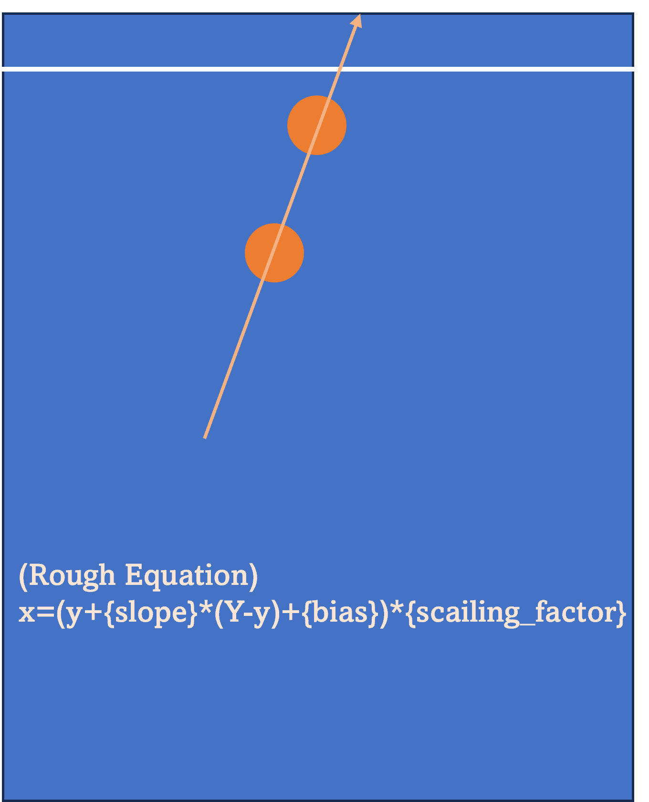

# 2023 창의융합경진대회

🏓 탁구로봇 제작 부문 - 디펜스페셜리스트 팀 (최우수상 🏆)

- Our robotics project, making table-tennis robot had been developed by @inthree3, @jjicjjjic, Kim Tae-gon, Kang min-seok, from 2023-07-07 to 2023-08-18.

# 1. 개발 환경 - Environment

## 하드웨어 구성요소: HardWare Information

- 2 Brio pro web cam
- DYNAMIXEL mx-64
- Linear actuator (Brand unknown)
- 3D Printed links (Made with CAD)

## 소프트웨어 구성요소: SoftWare Information

- Python 3.8
- opencv-python, numpy
- Labview (C++)

## 카메라 세팅: Cameras Setting

# 2. 목표 및 개요 - Objective and Overview

## 목표 및 평가방법: Goal of the Project and Evaluation Method

- 사람과 탁구 랠리를 더 원활하게 할 수 있는 로봇을 지향하며, 이를 로봇과 사람간의 랠리 횟수를 통해 평가한다.

## 컴퓨터 비전부 개요: Computer Vision Overview

- Color Detection: HSV 색 기반의 탁구공 인식
  - Color Range Defined by Human: We tried the methods of 'defining color range based on the pixel HSV value of the ball'. But because of the lack of fps and shutter speed, the color detected differently depending on the ball's speed. Hence, the human defined range which is considered to include all the possible color ofa table-tennis ball (orange).
- Linear Regression: 선형 예측
  - Half table-tennis rally was about 0.4 to 0.6s. As the ball detection accuracy was almost 100%, the detection is occurred 3~4 times in average. But in the case of human toss the ball near by the table's net, the detection could be occurred only 1~2 times. Therefore, the linear regression with 2 points was most stable system which we found in practical experiment.
    
- Mono Vision: 카메라 한 대를 사용한 비전 시스템
  - We firstly developed the stereo system installed two cameras top seeing down the table. But because of the delay about 0.1s between two cameras which was critical for speedy ball, we should change our camera setting locations or use one camera. We firstly implemented the mono vision system and it worked at some degree. Considering risk of changing locations and limited time to the final competition, we chose to using the mono vision system.

## 로봇 제작 및 제어부 개요: Robot Manufacturing and Control Overview

- to be updated ✏️

# 3. 개선점 - Future Direction

## 컴퓨터 비전부: Computer Vision

- More Accurate Lens Correction: 더 정확한 카메라 왜곡 보정
  - We suffered from the problem of camera distortion that if the z-coordinate increases, the x-coordinate is also increases without intention at the edge of the screen. We used checkerboard printed on A4 paper for lens correction. The bigger, clearer, and flatter checkerboard would make nicer quality of correction. ⭐⭐⭐
- Changing the Cameras' View & Stereo Vision: 왜곡에 강건한 카메라 뷰 & 스테레오 비전으로 변경
  - Our current system was weak for distortion. Because, we predict the balls' x-coordinate based on linear regression and of which the negative slope value could be positive and vice versa because of the distortion. So, we expect with the camera views in diagonal direction and the stereo vision(since it hardly be a mono vision system), the sudden and unexpected errors would be reduced.
- Reduce the Calculation Time
  - Our calculation time of one cycle from ball detection to send the estimated x-coordinate to machine was 0.05~0.1s. Since the GIL(Global Interpreter Lock) mutex, this high CPU demands program could not benefit from the multi-thread. However, the calculation time could be enhanced processing the steps of the cycle like (1) ball detection (2) linear regression (3) communication with machine in parallel. This could not be succeed by the lack of memory, but if it success it will improve the performance because this system and goal is highly sensitive to the latency.

## 로봇 제작 및 제어부: Robot Manufacturing and Control

- to be updated ✏️

# 4. 제작 과정 기록물 - Making Logs

🦾 Robot Control: to be updated ✏️
👁️ Computer Vision: to be updated ✏️
